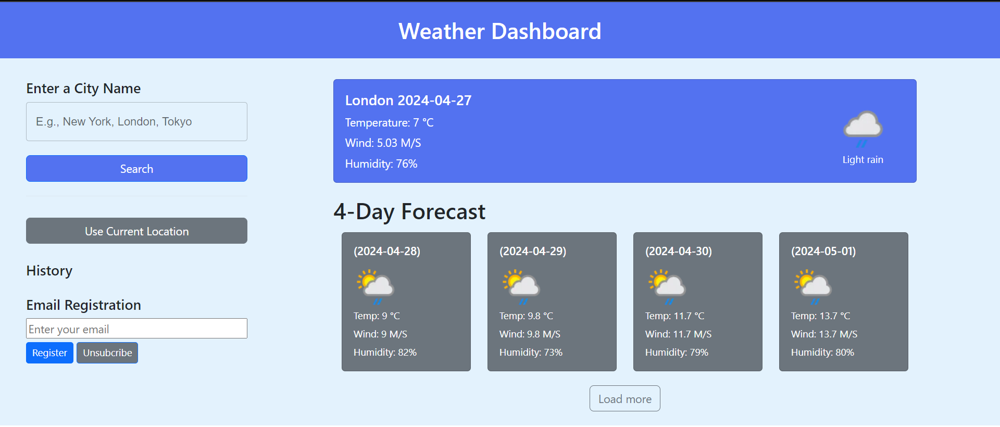

# G-Weather-Forcecase

## Web:

Use service from API provider https://www.weatherapi.com (free version)

## Must Have:

### Backend API Processing:
The application ensures that all API processing is handled on the backend.

### City or Country Weather Search:
Users can search for weather information by city or country. The application displays current weather data including temperature, wind speed, and humidity for the present day.

### Weather Forecast:
The application provides a forecast for at least 4 days later. Additionally, users can load more forecast data if needed.

### Temporary Weather Information History:
Weather information is saved temporarily, allowing users to access previously searched data again.

### Email Subscription for Daily Weather Forecast:
Users can register and unsubscribe to receive daily weather forecast information via email address. Confirmation emails are sent to ensure the validity of the email address.

### Deployment:
The application is deployed and live for users to access.

## Technical Requirements

### Frontend:
- React js.
- Library: React Bootstrap, Material UI, Axios
- Hook: useState, useEffect

### Backend:
- PHP, OOP.
- Link: [weather-myapi](https://weather-myapi.000webhostapp.com)

### Deployment:
- Deployment be achieved using various platforms:
  - [Back-end: 000webhost](https://.comhttps://panel.000webhost.com/dashboard/weather-myapi/databases)
  - Front-end: haven't deployed

### Author
- Doan Quoc Huy

